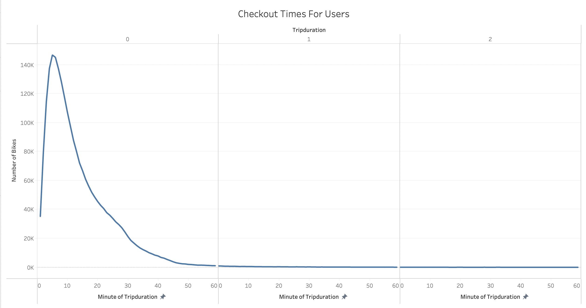
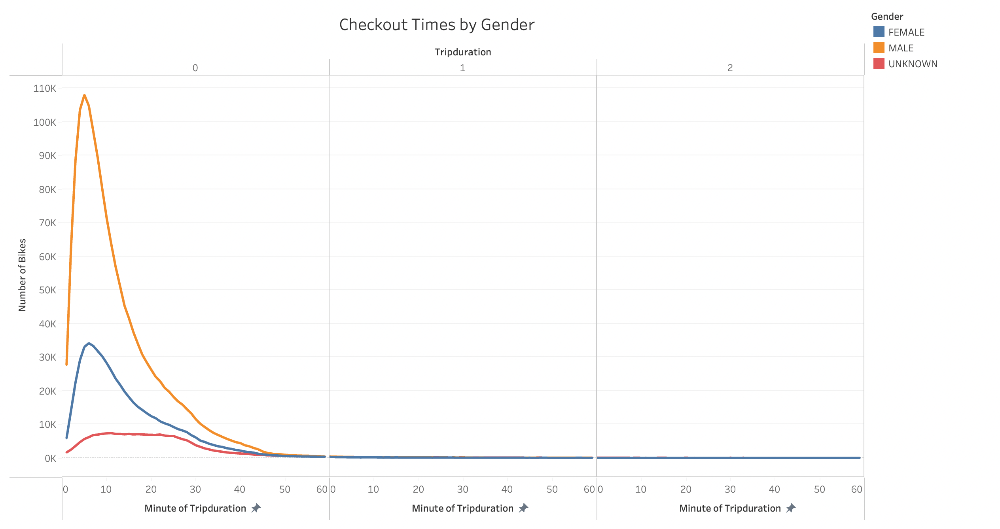
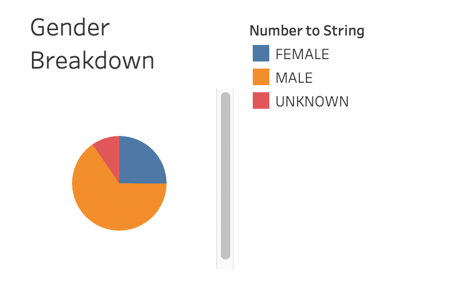
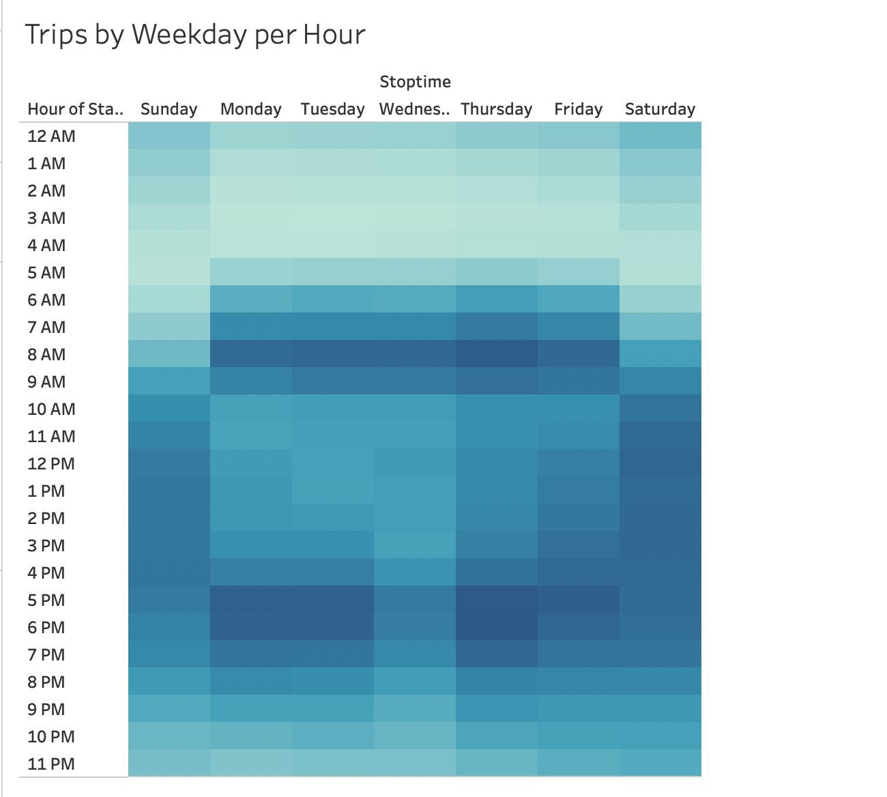
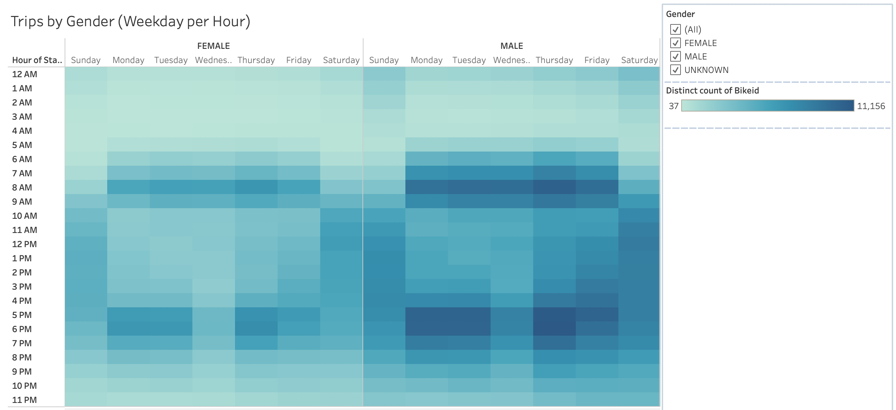
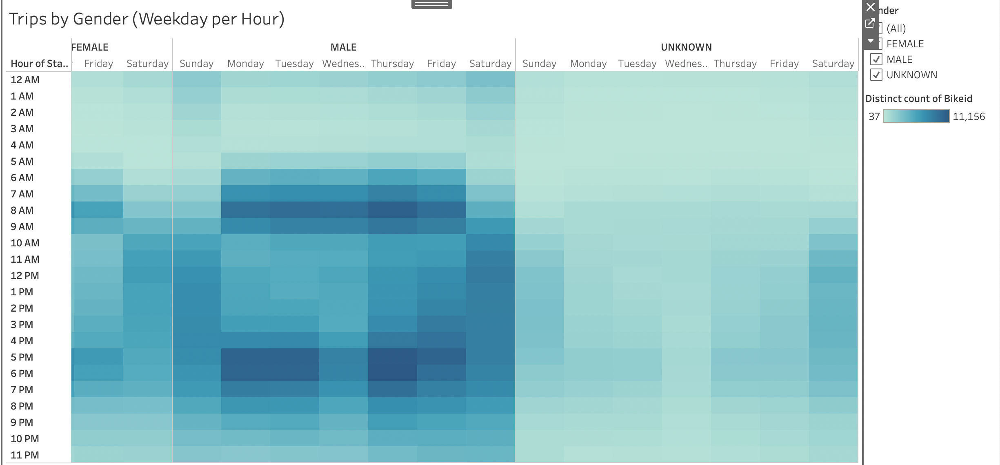
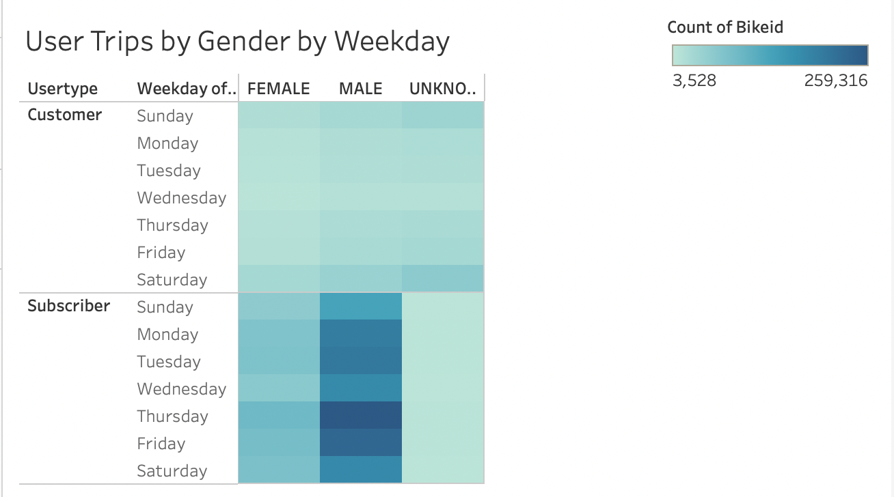
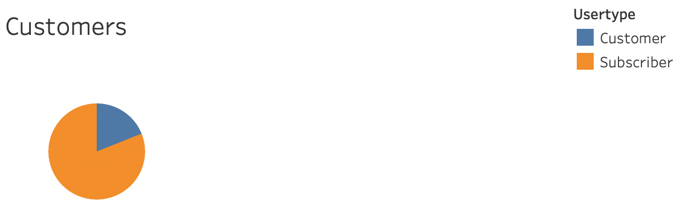

## Citibike Analysis

## Overview of the analysis

Tableau was used for this analysis to present a business proposal for a bike-sharing company. Worksheets, dashboards and stories were made to visualize key data from a New York Citi bike dataset.

## Results

Data shows that Citi Bike riders in NYC use their bikes for less than an hour with a huge spike of users for just 10 minutes.

The data also shows that a large majority of Citi Bike riders are male as seen in both the charts below.

The following heatmap shows that most bikes are used Monday - Friday from 7am to 10 am as well as 5pm to 7pm via the darker blues in the visual. This is most likely reflective of individuals who use Citi Bike to commute to and from work. On Saturdays and Sundays ridership is more spread out throughout the day as shown through the darker blue on the heatmap between 10am and 8pm during these days.

The same trends in terms of most popular ride times for each day of the week hold for all genders. The heatmap for males is darker than the others, again showing the fact that there are significantly more males who ride Citi Bike compared to other genders

Overall, most Citi Bike users are subscribers as opposed to single time riders shown through the heatmap below. Clearly most people who use Citi Bikes ride often or at least enough to believe that a subscription is a more preferrable way to use the service

We can similarly see that the users of Citi Bike in New York City are subscribers through the pie chart below.

# Summary

Overall, there were definitely trends in Citi Bike data from New York City involving trip duration, gender, user type, and riding time. This information could easily be used to help guide the implementation of ride sharing in any other major cities. Additional visualizations/data that might be insightful in the future could include looking at customer demographic by occupation to see if there is a trend between particular jobs and Citi Bike usage as well as income. This additional data would be best visualized as a bar or pie chart.
